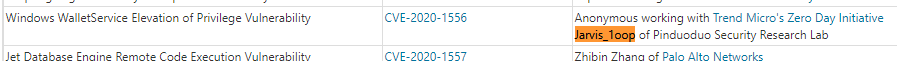
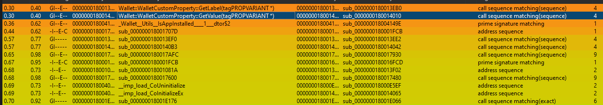
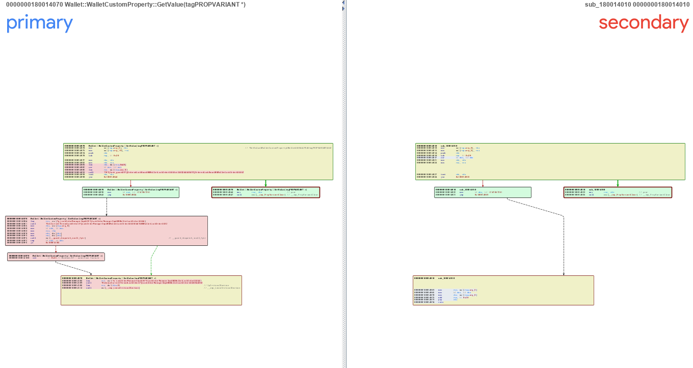
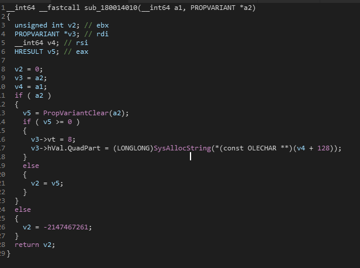
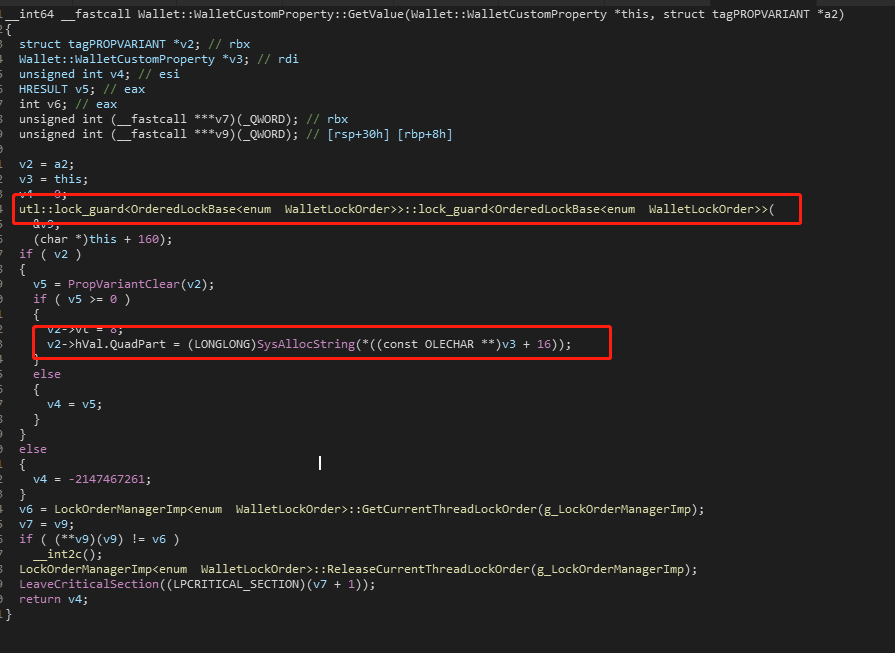
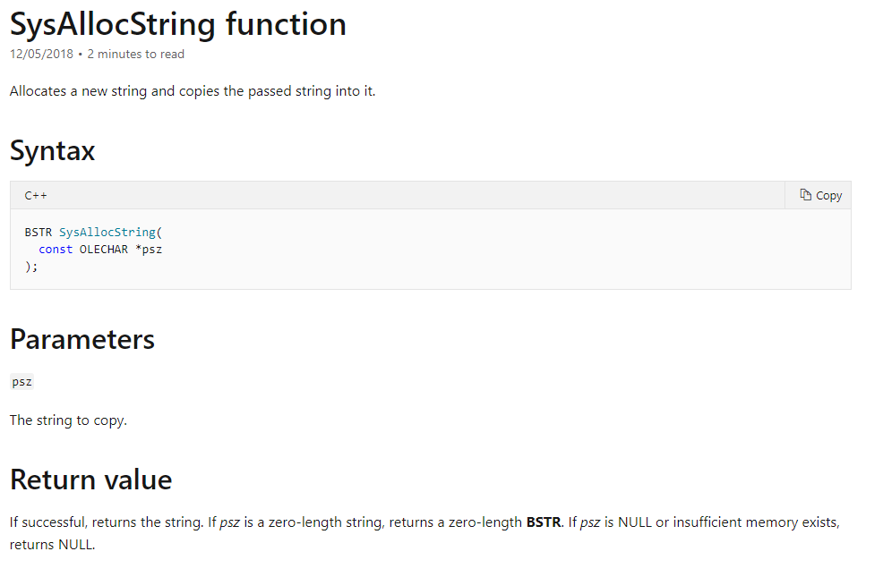
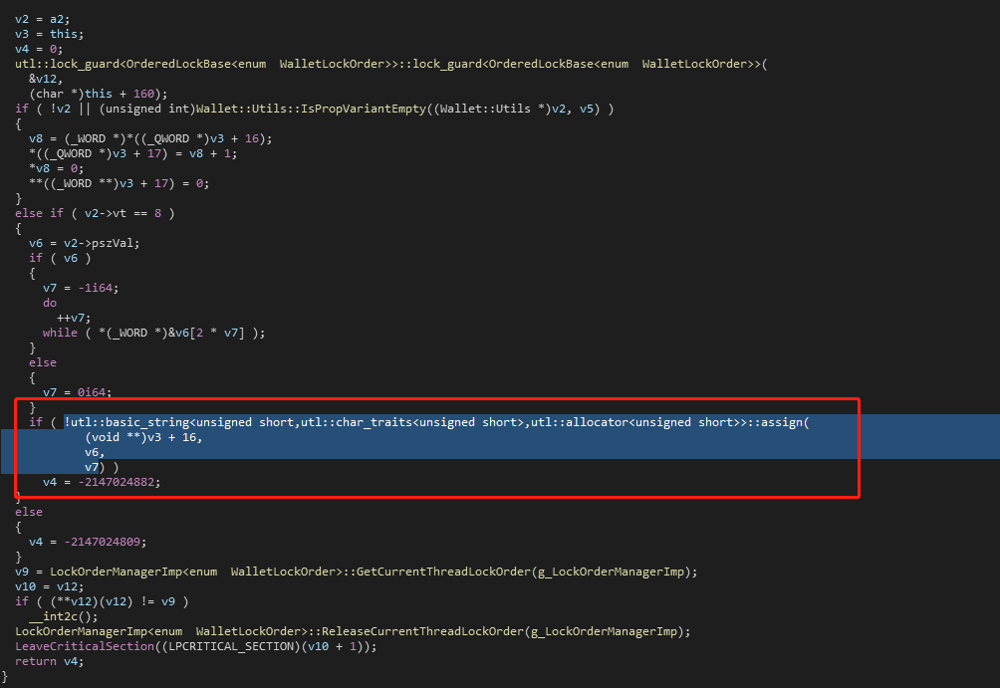

## 2020-08-19

对ms 8月更新里的walletservice.dll进行补丁分析，来康康 	CVE-2020-1556  到底是长什么样子的。

打开bindiff 可以看见函数 Wallet::WalletCustomProperty::GetValue 和Wallet::WalletCustomProperty::GetLabel 代码进行大量修改。

 Wallet::WalletCustomProperty::GetValue  内新添加了 Lock来安全地访问共享资源，Wallet::WalletCustomProperty::GetLabel  内部也是。

打补丁前：

打补丁后：

在Lock 内部比较敏感的代码就是 (LONGLONG)SysAllocString(*((const OLECHAR **)v3 + 16));

msdn 显示SysAllocString 是分配一个新string, 并把 参数 psz 拷贝到新 string 里。

那么就知道漏洞点了：

- 首先通过 参数 psz 获取新string 需要分配的大小。
- 在拷贝前通过条件竞争，修改psz的内容使其内容长度大于之前分配的长度。
- 拷贝，因为原子操作被打破，导致堆溢出。

如何条件竞争？

和 Wallet::WalletCustomProperty::GetValue 配套的还有一个函数 Wallet::WalletCustomProperty::SetValue
该函数可以设置 *((const OLECHAR **)v3 + 16 的内容

所以理论上开一个线程，调用 Wallet::WalletCustomProperty::SetValue 不断的写入一长一短两个字符串。
那么就有可能触发该漏洞。

